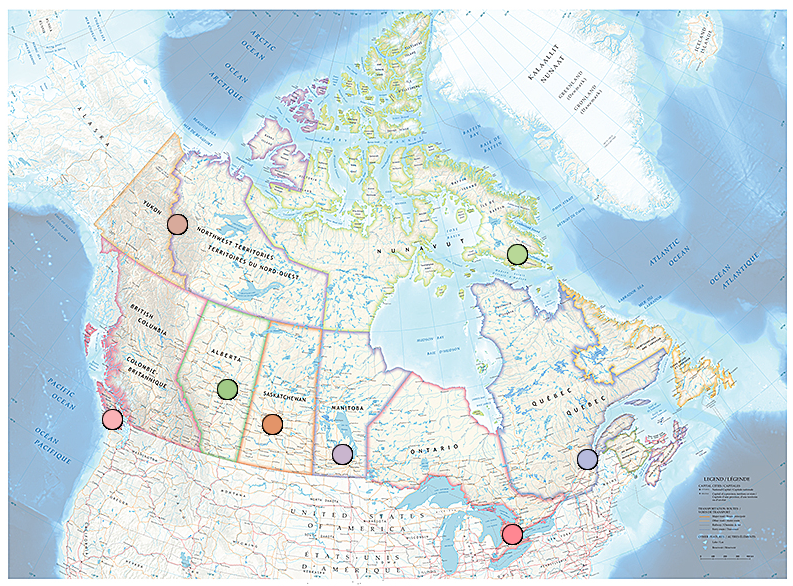
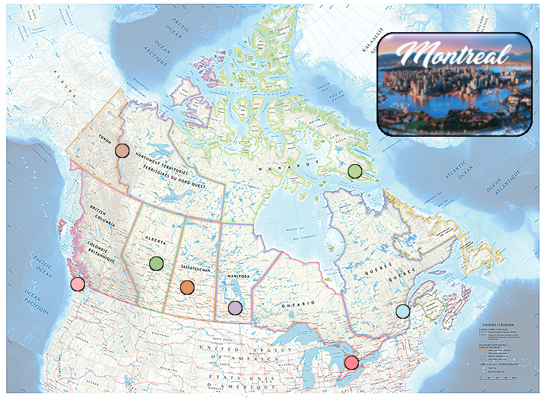
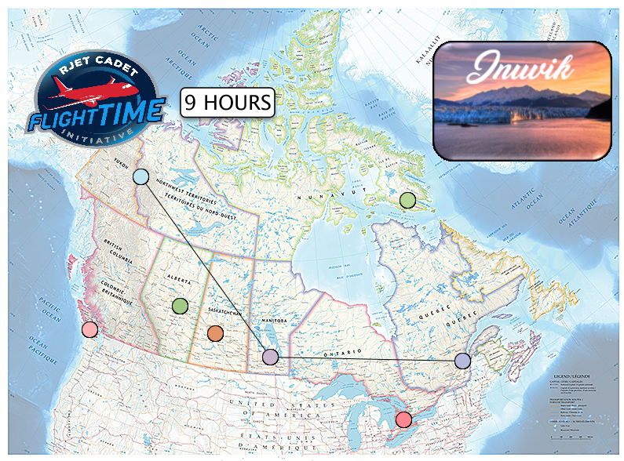

# Graphical User Interface (GUI) Project
A Graph Visualizer and Shortest Path Finder Using Dijkstra's Algorithm, Written in Processing.
	
## Usage
After running the program in Processing, you will be greeted with the map of Canada with nodes in the major cities.

Hovering over any of these nodes will change the color of the node plus show an image of the city.

Clicking on any two nodes will perfom Dijkstra's Shortest Path Algorithm to display the shortest path from the graph and flight time.

